# 🛰️ Orbit: satellite intelligence for commodities

> **Satellite intelligence for commodities. Fully agentic.** AI agents watch farms, reservoirs and data centres from orbit, judge the world's news with Jev, and forecast commodity prices before markets move.
> **Gemini sees · Jev judges · Modal scales**

Built in one day at the **{Tech: Europe} Agentic AI Hack London**, co-hosted by Conduct and Google DeepMind (partners Modal and Pydantic).

**▶ Live demo:** https://bernararno17--orbit-web-web.modal.run (opener at [`/landing`](https://bernararno17--orbit-web-web.modal.run/landing)) · **Repo:** https://github.com/londrwus/techeu_agentichack

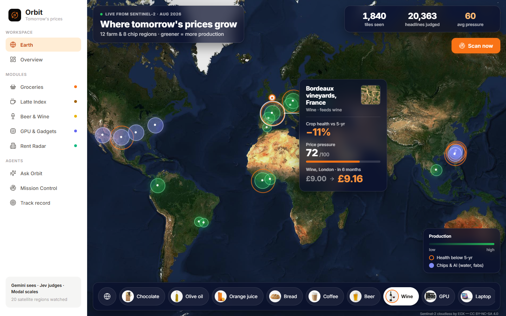

## What it does in 30 seconds

**The problem.** Price shocks start far from the till: a drought in Spain's olive groves, a dry reservoir next to Taiwan's chip fabs, a new AI campus in Texas buying up GPUs. By the time a Londoner pays more for olive oil, a latte or a graphics card, the cause is months old. Nobody connects those dots for ordinary people.

**The solution.** Orbit watches those places **from orbit**, reads the world's news, and turns both into commodity price forecasts, plus what they mean for everyday prices in London:

1. **Sees.** Real **Sentinel-2** satellite imagery for 20 farms, reservoirs, fabs and data centres (1,840 tiles), processed on **Modal**. **Gemini** looks at "then vs now" images and says what changed.
2. **Judges.** **Jev** (TypeSafe) turns 24,390 headlines and every region's satellite history into **142,016 typed judgments with calibrated probabilities**.
3. **Forecasts.** **Google TimesFM 3.0** on NVIDIA L4 GPUs, plus a validated model stack, gives a 10–90% price range, the chance of a rise, and *why*.
4. **Explains.** A dashboard with a 3D London rent map, a live "Scan now" across up to 100 Modal containers, an agent you can ask ("Will my latte cost more by Christmas?"), and a spoken briefing in Gemini's voice.

It covers five modules: 🛒 Groceries · ☕ Latte Index · 🍺 Beer & Wine · 🖥️ GPU & Gadgets · 🏠 Rent Radar.

## How it works

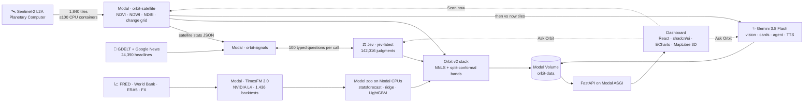

More diagrams (live scan sequence, Ask Orbit sequence, build order): **[docs/ARCHITECTURE.md](docs/ARCHITECTURE.md)**.

## Built with

| | Technology | How Orbit uses it | Scale (from `data/built/`) |
|---|---|---|---|
| ✨ | **Google Gemini 3.8 Flash** (`google-genai` 2.24, Interactions API) | Multimodal vision on then-vs-now satellite tiles; JSON-schema insight cards; function-calling agent with 4 tools | 42 build calls, 16 vision notes, 5 module cards, plus live Ask calls |
| 🔊 | **Gemini 3.1 Flash TTS** | "Tomorrow's Prices" spoken briefing, voice Charon | cached WAV plus on-demand regeneration |
| 🖼️ | **Gemini 3.1 Flash Image** | Product photography for all 10 items | 10 images |
| 📈 | **Google Research TimesFM 3.0** | Zero-shot quantile forecasts | 1,436 point-in-time runs on **10 × NVIDIA L4**; 6,695 training contexts |
| ⚖️ | **TypeSafe Jev** (`typesafe-sdk` 0.7.0, `jev-latest`) | `Noul` / `Choice` / `Score` judgments with calibrated probabilities and confidence; routes every Ask question (confidence-gated at 0.5) | **142,016 judgments**, 24,390 headlines, ~$0.70; live peak **480 judgments/s** |
| ☁️ | **Modal** (1.5.5) | CPU fan-out, L4 GPUs, Volumes, Secrets, retries, `Function.from_name` live calls, ASGI web hosting | **100 containers** at peak; 1,840 tiles in 673 s; live scan of 120 tiles + 800 judgments in **45.8 s** |
| 🛰️ | **Sentinel-2 via Microsoft Planetary Computer** | 10 m imagery, 5 bands + cloud mask, 2019-01 → 2026-08 | 20 regions × 92 months; 33 boroughs; 2,406 H3 hexes |
| 🌍 | **EOX Sentinel-2 cloudless**, MapLibre GL, ECharts | Earth view and landing globe; 3D Rent Radar; fan charts and waterfalls | – |
| ⚛️ | **React 19 + Vite 8**, **Tailwind v4**, **shadcn/ui**, react-router, lucide-react, sonner | The dashboard (11 routed screens, shadcn primitives wearing the Orbit design system) and the landing page (a WebGL2 globe shader on a baked Sentinel-2 texture) | 11 lazy route chunks; landing paints in ~0.3 s |
| 📊 | Nixtla statsforecast, LightGBM, scikit-learn, NumPy | Model zoo, stacking, split-conformal intervals | up to 100 CPU containers per fit |
| 🎨 | **Pencil (pen.dev) via MCP** | UI designed in `design/orbit.pen`, then implemented | 1440×900 frames |
| 🐍 | FastAPI, Pydantic 2, Uvicorn | Backend, SSE streaming, request models | 18 routes |

Deep dives: **[Jev](docs/JEV.md)** · **[Modal](docs/MODAL.md)** · **[Gemini & TimesFM](docs/GEMINI.md)** · **[Full tech stack and data licences](docs/TECH_STACK.md)**

> All numbers in this README come from `data/built/summary.json`, `data/built/*/_stats.json` and `data/built/eval/*.json` as of 2026-09-19. The pipelines regenerate them, so the files are the source of truth.

## Feature tour

| | |
|---|---|
| **Landing** (`/landing`): a rotating Sentinel-2 globe, satellite regions pulsing, arcs flowing to London. It opens the demo in 5–10 s. <br><br> **Earth** (`#/earth`): a world map on EOX Sentinel-2 cloudless with all 20 regions. Hover one to see its crop, water or build-out health vs the 5-year norm, the price pressure, and the London price in 6 months. | 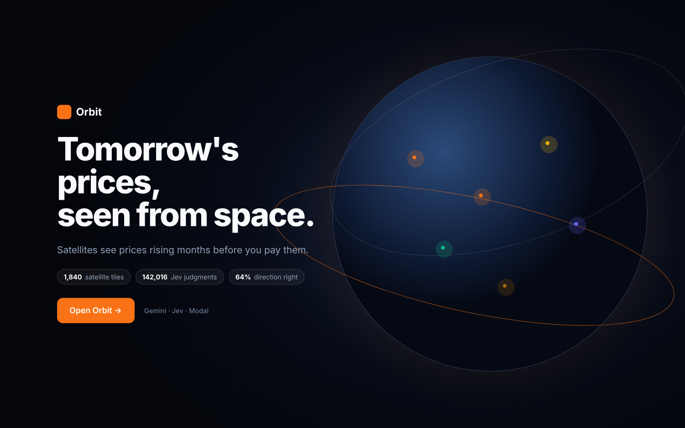 |
| **Overview** (`#/overview`): pressure scores 0–100 for the five modules (35% satellite risk, 25% Jev news, 40% forecast), Tomorrow's Basket, and a satellite watch-list map. | 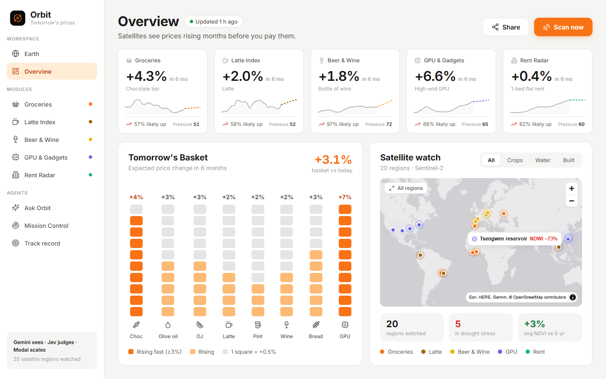 |
| **Groceries** (`#/groceries`): a shop-style page for chocolate, olive oil, orange juice and bread. Each item has a fan chart (p10–p90), the chance of a rise, a before/after satellite slider, and an out-of-sample backtest story. | 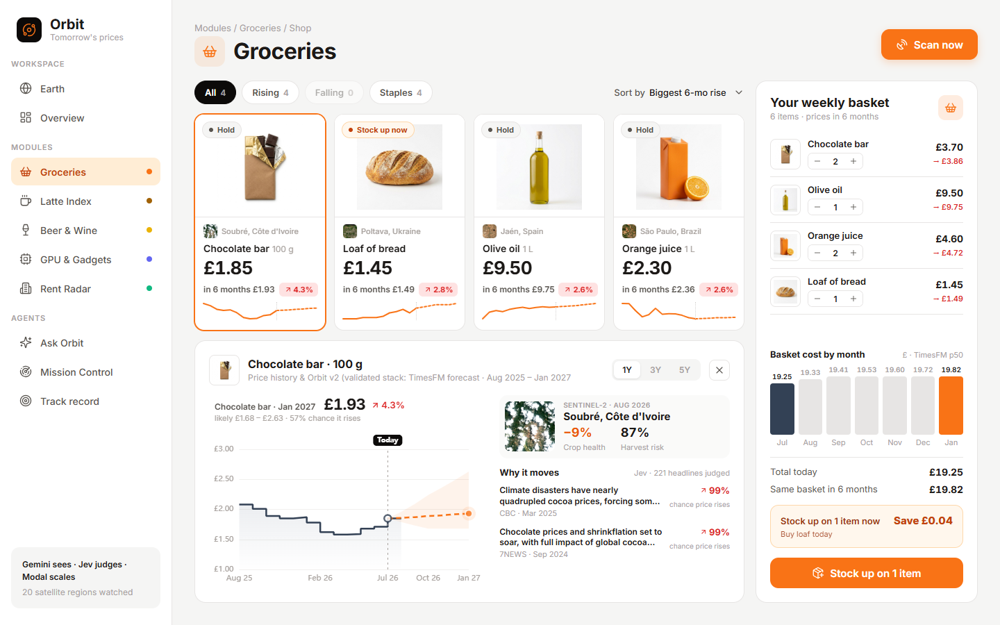 |
| **Latte Index** (`#/latte`): coffee regions in Brazil, Vietnam and Colombia. A waffle of Jev-judged headlines (8,728 judgments for coffee) and Gemini cards: *£3.95 → £4.03 in 6 months*. | 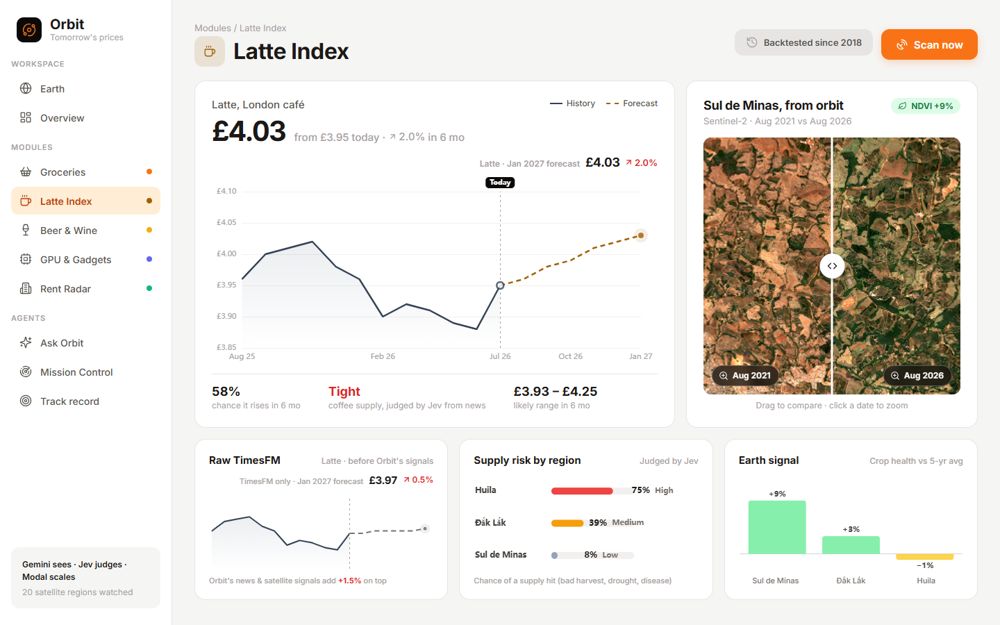 |
| **Beer & Wine** (`#/beer_wine`): hops in Hallertau and Žatec, vines in Bordeaux and Rioja. A pint and a bottle, with drivers and supply risk. | 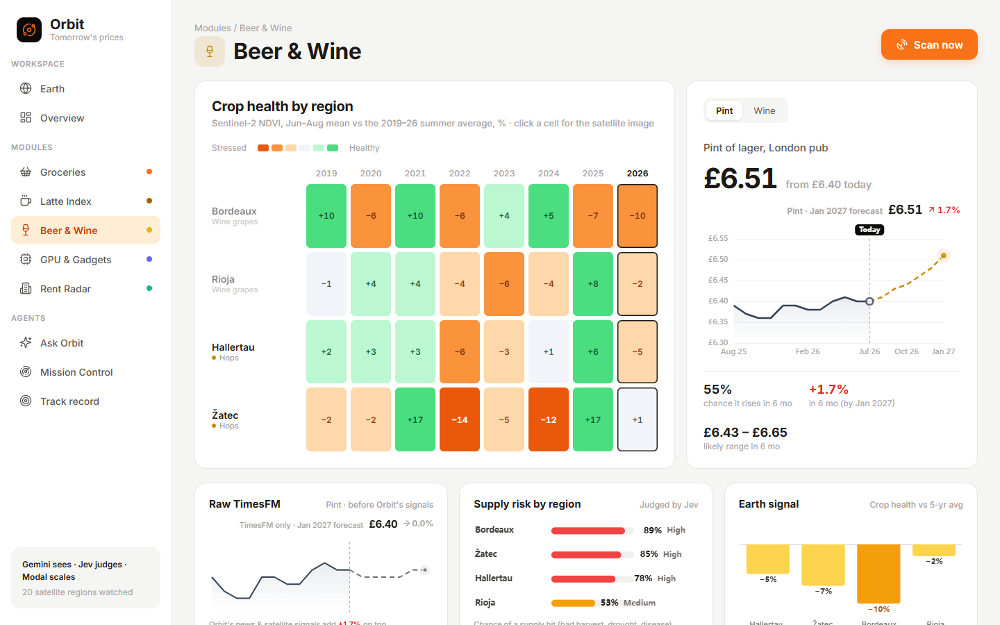 |
| **GPU & Gadgets** (`#/gpu`): "AI is eating the world's GPUs". A driver waterfall (trend, Jev AI-demand and memory-shortage signals, data centres seen being built), a Stargate / xAI / TSMC before-after slider, Jev supply risk by site, and Taiwan reservoir levels. | 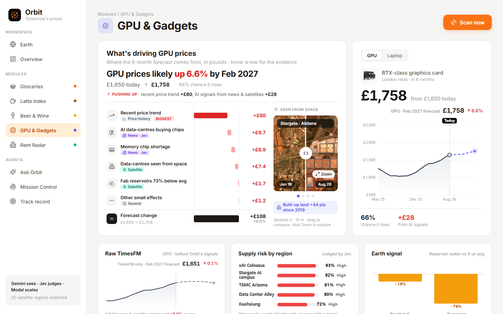 |
| **Rent Radar** (`#/rent`): London in 2D or 3D. Height is new building seen from orbit (real Sentinel-2 NDBI change since 2019) and colour is rent pressure. Zoom in to 2,406 neighbourhood hexagons. | 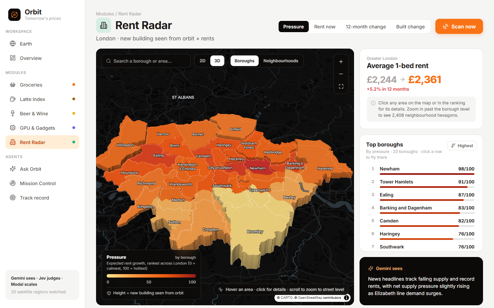 |
| Neighbourhood level: H3 hexagons with search, ranking and click-to-fly. | 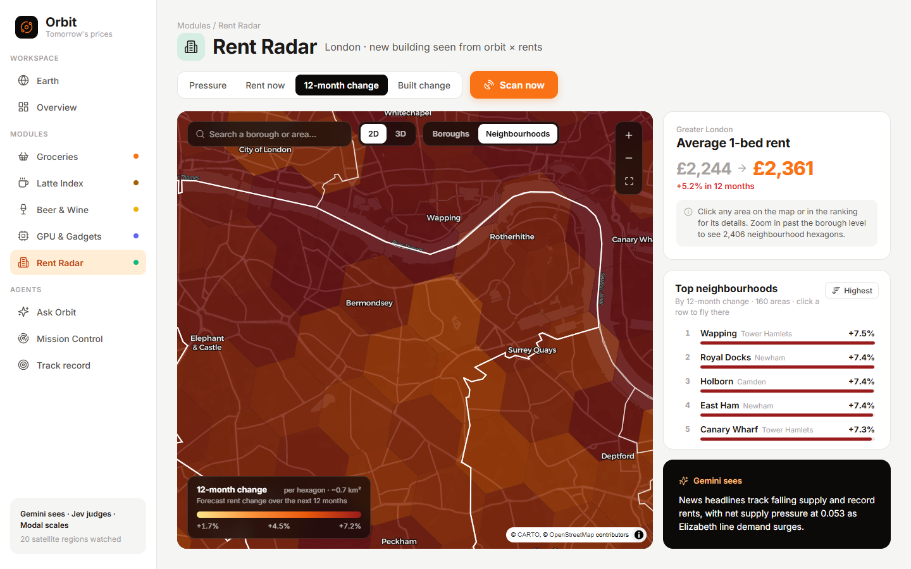 |
| **Mission Control** (`#/mission`): **Scan now** fans out 120 tiles and 5 news sweeps across Modal while you watch. It shows live containers, tiles arriving, Jev judgments per second, and Gemini / Jev / Modal provider cards. A recorded replay is the offline fallback. | 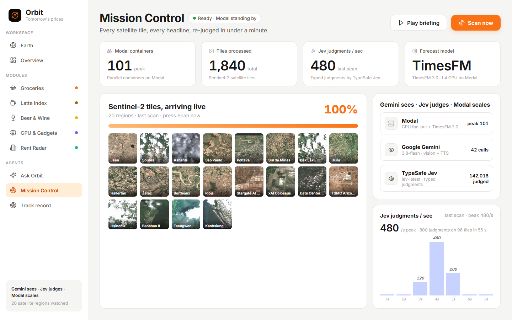 |
| **Ask Orbit** (`#/ask`): type or speak a question. Jev routes it ("Beer & Wine · 100% confident"), Gemini calls Orbit's tools and answers in ≤ 3 sentences with a chart. "Play the spoken briefing" uses Gemini TTS. | 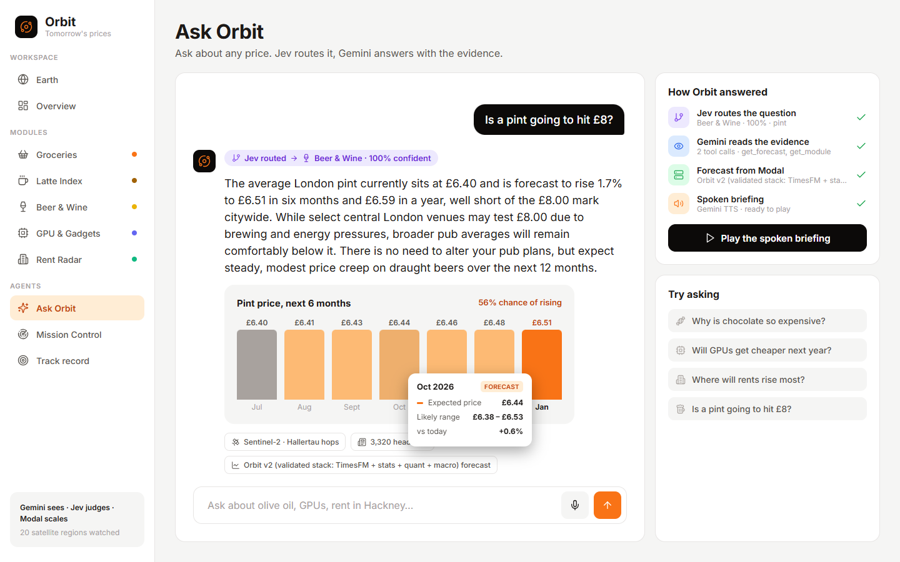 |
| **Track record** (`#/track`): "How right is Orbit?" 266 unseen 2023–26 forecasts, a leaderboard of every model we tried, calibration, and the hits *and* misses. | 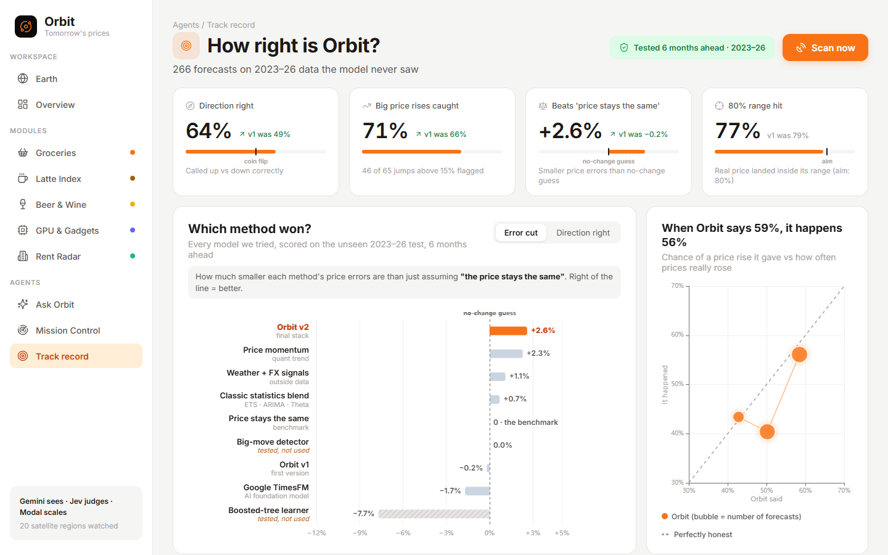 |

## Key results (honest)

We re-ran every model **as if it were the past**: at each monthly cutoff since 2018, it only saw data up to that month. All choices were made on 2020–22 **validation** data, and the model was scored once on the **2023–26 test** period. Test, 6 months ahead, 8 items, 266 forecasts ([`data/built/eval/leaderboard.json`](data/built/eval/leaderboard.json)):

| Method | MAPE | Skill vs "no change" | Direction right | 80% range hit | Big rises (>15%) caught |
|---|---|---|---|---|---|
| Naive (price stays the same) | 19.2% | 0 | – | – | 0 / 65 |
| Google TimesFM 3.0 alone | 19.1% | −0.017 | 50% | 76% | 32% |
| Orbit v1 (tuned overlay) | 19.7% | −0.002 | 49% | 79% | 66% |
| **Orbit v2 (validated stack)** | **18.9%** | **+0.026** | **64%** | 77% | **71%** |

- **Small but real.** v2's 6-month edge over "no change" is +2.6%, with a block-bootstrap 90% CI of +0.5% … +4.0%. At 3 months it is +1.7%. At **12 months it does not beat no-change** (−3.0%).
- **We show the misses.** In 2023-10, v2 said chocolate +3%. It went **+167%**. Big-rise alerts catch 82% of spikes but with ~27% precision.
- **The satellite signal has no standalone forecast skill yet.** The tuned Sentinel-2 tilt got weight 0 out-of-sample. Satellites still feed the pressure scores, the Jev region judgments, the weather/satellite ridge member and the GPU build-out driver.
- **The leakage audit is published.** The test set was seen once before three a-priori design changes, and LLM/TimesFM pre-training may know the future. Full details: **[docs/MODEL.md](docs/MODEL.md#6-leakage-audit)**.

## Quickstart

### Option A: look around in 2 minutes (no accounts needed)

The repo ships the built JSON, the recorded scan and the cached briefing. With no API keys, Ask Orbit falls back to a template answer, "Scan now" plays the recording, and satellite thumbnails are missing (they live on the Modal Volume).

```powershell
# Windows PowerShell
git clone https://github.com/londrwus/techeu_agentichack.git; cd techeu_agentichack
python -m venv .venv
.\.venv\Scripts\pip install -r requirements.txt
.\.venv\Scripts\uvicorn backend.main:app --port 8000      # open http://localhost:8000/landing
```

```bash
# macOS / Linux
git clone https://github.com/londrwus/techeu_agentichack.git && cd techeu_agentichack
python3.12 -m venv .venv
.venv/bin/pip install -r requirements.txt
.venv/bin/uvicorn backend.main:app --port 8000            # open http://localhost:8000/landing
```

### Option B: the full stack

**1. Keys.** Create `.env` in the repo root. It is git-ignored, so never commit it.

```dotenv
GEMINI_API_KEY=...        # Google AI Studio
TYPESAFE_API_KEY=...      # TypeSafe / Jev
```

**2. Modal.** Log in once, then create the secret and the data Volume. `orbit-models` is created automatically.

```powershell
.\.venv\Scripts\modal setup                                   # or: modal token new
.\.venv\Scripts\modal secret create orbit-secrets GEMINI_API_KEY=<key> TYPESAFE_API_KEY=<key>
.\.venv\Scripts\modal volume create orbit-data
```

**3. Run the pipelines in this order.** Everything caches on the Volume; add `--force` to recompute. Set `PYTHONPATH` so Modal can ship the shared `orbit/` package. Files with several entrypoints need `::main`.

```powershell
$env:PYTHONPATH = "."; $env:PYTHONIOENCODING = "utf-8"
# data on Modal
.\.venv\Scripts\modal run modal_app/satellite.py::main        # 1,840 Sentinel-2 tiles on ≤100 containers (~11 min)
.\.venv\Scripts\modal run modal_app/signals.py::main          # headlines → Jev judgments
.\.venv\Scripts\modal run modal_app/signals.py::ai            # AI-era GPU layer
.\.venv\Scripts\modal run modal_app/signals.py::regions       # Jev judges each region's satellite JSON
.\.venv\Scripts\modal run modal_app/forecast.py               # TimesFM 3.0 on L4 (fetches FRED locally first)
.\.venv\Scripts\modal run modal_app/rent.py
.\.venv\Scripts\modal run modal_app/rent_detail.py
# evaluation + model zoo
.\.venv\Scripts\modal run modal_app/evaluate.py               # 1,436 point-in-time runs on 10 × L4, then build_eval.py
.\.venv\Scripts\modal run modal_app/train.py                  # LightGBM learner on TimesFM features
.\.venv\Scripts\modal run modal_app/zoo_stats.py
.\.venv\Scripts\modal run modal_app/zoo_live.py
.\.venv\Scripts\modal run modal_app/zoo_quant.py
.\.venv\Scripts\modal run modal_app/zoo_exog.py
# assemble locally
.\.venv\Scripts\python scripts/pull_data.py                   # Volume /built → data/built (incl. ~210 MB tiles)
.\.venv\Scripts\python scripts/build_zoo.py                   # leaderboard + Orbit v2 (+ live v2)
.\.venv\Scripts\python scripts/build_orbit_signal.py          # live forecasts + drivers
.\.venv\Scripts\python scripts/build_insights.py --force      # Gemini vision notes + cards
.\.venv\Scripts\python scripts/build_summary.py --briefing    # pressure scores + Gemini TTS briefing
```

On macOS / Linux, use `.venv/bin/...` and `export PYTHONPATH=. PYTHONIOENCODING=utf-8`.

**4. Run locally.**

```powershell
.\.venv\Scripts\uvicorn backend.main:app --reload --port 8000
```

The dashboard is a React app (`web/`) whose build is committed to `frontend_react/`, so this works
straight from a clone. Rebuild it after changing the UI — or run the Vite dev server beside the backend:

```powershell
cd web; npm install; npm run build      # -> ../frontend_react, served at /
cd web; npm run dev                     # http://localhost:5173, proxies /api /tiles /static to :8010
```

**5. Deploy.** Deploy the live-scan functions and the web app, and push locally built files to the Volume:

```powershell
.\.venv\Scripts\modal deploy modal_app/satellite.py            # process_tile for "Scan now"
.\.venv\Scripts\modal deploy modal_app/signals.py              # fetch_latest / judge_headlines
.\.venv\Scripts\modal volume put --force orbit-data data/built/eval /built/eval
.\.venv\Scripts\modal volume put --force orbit-data data/built/forecast /built/forecast
.\.venv\Scripts\modal volume put --force orbit-data data/built/insights /built/insights
.\.venv\Scripts\modal volume put --force orbit-data data/built/summary.json /built/summary.json
.\.venv\Scripts\modal deploy modal_app/web.py                  # public URL: https://<workspace>--orbit-web-web.modal.run
```

The deployed app reloads the Volume every 60 s, so new data appears without a redeploy.

### Troubleshooting

| Problem | Fix |
|---|---|
| Git Bash turns `/built/eval` into `C:/Program Files/Git/built/eval` | Prefix with `MSYS_NO_PATHCONV=1`, e.g. `MSYS_NO_PATHCONV=1 modal volume put --force orbit-data data/built/eval /built/eval`, or use PowerShell |
| `UnicodeEncodeError` (emoji, `£`, `Jaén`) on Windows | `$env:PYTHONIOENCODING = "utf-8"` (Git Bash: `export PYTHONIOENCODING=utf-8`) |
| `ModuleNotFoundError: orbit` in `modal run` | Run from the repo root with `PYTHONPATH=.` |
| Modal asks which function or entrypoint to run | Use `::main` (e.g. `modal_app/signals.py::main`) |
| Modal rejects GPU functions ("add a payment method") | Add a payment method in Modal, or run `forecast.py` on CPU with `$env:ORBIT_GPU = "cpu"`. `evaluate.py` and `train.py` need a GPU. |
| FRED download fails on Modal | Expected: FRED blocks many cloud IPs. `forecast.py` / `evaluate.py` fetch FRED from your machine and upload it. |
| "Scan now" replays instead of going live | Deploy `satellite.py` and `signals.py`, and check `modal token`. Replay is the intended fallback. |
| Satellite thumbnails are blank locally | `python scripts/pull_data.py tiles` (needs Modal access), or run the satellite pipeline |

## Project structure

```
orbit/config.py            single source of truth: modules, 20 regions, 10 items, backtest stories
modal_app/
  satellite.py             orbit-satellite   Sentinel-2 → indices + PNG, ≤100 containers
  signals.py               orbit-signals     GDELT / Google News → Jev judgments; AI index; region judgments
  forecast.py              orbit-forecast    FRED / curated / synthetic → TimesFM 3.0 on L4
  evaluate.py              orbit-eval        1,436 point-in-time TimesFM backtests on 10 × L4
  train.py                 orbit-train       LightGBM stacked on TimesFM (World Bank panel)
  zoo_stats.py zoo_live.py orbit-zoo-stats   AutoETS / AutoARIMA / AutoTheta + conformal
  zoo_quant.py             orbit-zoo-quant   ridge momentum, big-move classifiers
  zoo_exog.py              orbit-zoo-exog    ERA5 weather + satellite + FX ridge
  zoo_dir.py zoo_xasset.py (v3, in progress) direction classifier, cross-asset ridge
  rent.py rent_detail.py   orbit-rent(-detail) London boroughs + H3 hexes
  web.py                   orbit-web         FastAPI + frontend as a Modal ASGI app
backend/                   FastAPI: main.py (routes), agent.py (Jev + Gemini), scan.py (SSE fan-out),
                           briefing.py (Gemini TTS), data.py (readers, pressure), extra_*.py (routers)
scripts/                   pull_data, build_eval, build_zoo, zoo_meta, build_orbit_signal, build_insights, build_summary
web/                       React UI: views/ (one per screen), landing/ (splash + WebGL globe), components/ui (shadcn),
                           components/orbit, lib/ (api, charts, scan store, lightbox), styles/ (the design system),
                           public/ (product photos, baked globe texture)
frontend_react/            built React app (npm run build): / (dashboard) and /landing
data/built/                the data contract the UI reads (JSON, committed; tiles/ on the Volume only)
design/                    orbit.pen (Pencil), mock-ups, screenshots
docs/                      architecture, API, tech stack, Jev, Modal, Gemini, model, demo script
```

## Documentation

| Doc | What's inside |
|---|---|
| [docs/ARCHITECTURE.md](docs/ARCHITECTURE.md) | Components, Modal apps table, live-scan and Ask sequence diagrams, data contracts |
| [docs/API.md](docs/API.md) | Every HTTP endpoint with real example responses, the SSE event format, Modal function interfaces |
| [docs/TECH_STACK.md](docs/TECH_STACK.md) | Every library and service with version and location in code; data sources and licences |
| [docs/JEV.md](docs/JEV.md) · [docs/MODAL.md](docs/MODAL.md) · [docs/GEMINI.md](docs/GEMINI.md) | Why each partner technology, how we use it (with code), scale numbers |
| [docs/MODEL.md](docs/MODEL.md) | Forecasting methodology, splits, model zoo, stacking, conformal bands, leaderboard, leakage audit |
| [docs/DEMO.md](docs/DEMO.md) | The 3-minute demo script and fallbacks |

## Honest notes

- **Real vs synthetic.**
  - Real: every satellite tile, every headline and Jev judgment, and the commodity and CPI series.
  - Curated: the **GPU** street-price index (21 public anchor points, interpolated between them).
  - Synthetic but plausible: **wine** and **London rents**. The rent map's built-up change *is* real Sentinel-2.
- **Not backtested:** the Jev news-pressure term and the 3% UK CPI term in the live forecast, because headline history covers only about 2 years. The GPU and laptop AI-era driver coefficients are priors, not fitted.
- **Retail mapping** uses a fixed commodity pass-through share per item (`orbit/config.py`).
- **Data fix:** the FRED olive-oil series has a Nov–Dec 2020 glitch. Two points are replaced by the median of their neighbours.
- **AI images:** product photos and the `design/images/` mock-ups are Gemini-generated. No generated image is shown as satellite data.
- Everything was built from scratch during the hackathon. We used libraries, but did not fork or copy any existing project.

## Team and credits

Built by the Orbit team at the {Tech: Europe} Agentic AI Hack, London. Thanks to **Conduct**, **Google DeepMind**, **Modal**, **TypeSafe (Jev)**, **Pydantic** and {Tech: Europe}.

## Licences and attribution

- **Sentinel-2:** contains modified Copernicus Sentinel data 2019–2026, accessed via Microsoft Planetary Computer.
- **Background imagery:** "Sentinel-2 cloudless – https://s2maps.eu by EOX IT Services GmbH (Contains modified Copernicus Sentinel data 2020)", licensed **CC BY-NC-SA 4.0**. Non-commercial use only.
- **Basemaps:** © CARTO, © OpenStreetMap contributors; Esri World Light Gray Canvas.
- **Prices:** FRED (Federal Reserve Bank of St. Louis; IMF and BLS series); World Bank Commodity Price Data (CC BY 4.0).
- **News:** GDELT Project, Google News RSS (headlines and links only).
- **Weather:** Open-Meteo / ERA5 (CC BY 4.0).
- **Other data:** CFTC and NOAA public data.
- **Models:** TimesFM weights © Google (Apache 2.0).

See [docs/TECH_STACK.md](docs/TECH_STACK.md#external-data-sources) for the full list. The code in this repository was written for the hackathon. Because the EOX imagery is non-commercial, the deployed demo is non-commercial too.
