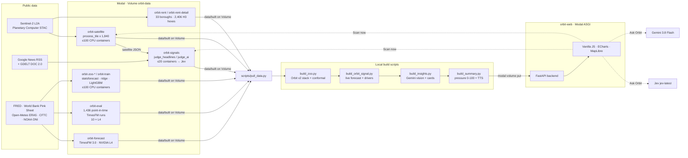
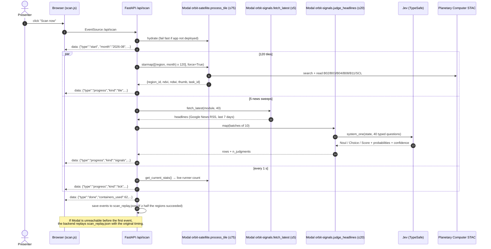
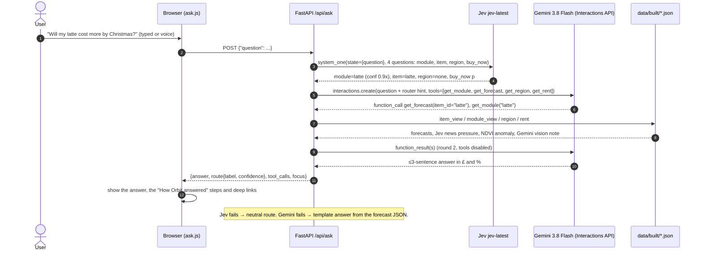
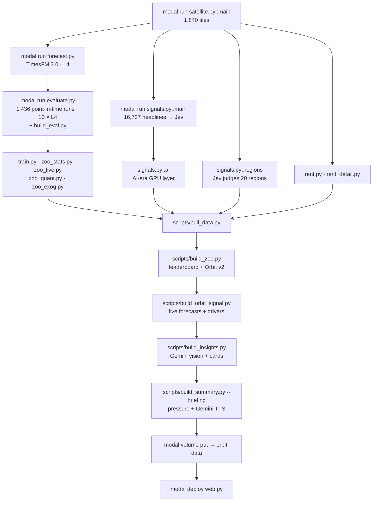

# Architecture

[← back to README](../README.md) · [API](API.md) · [Tech stack](TECH_STACK.md) · [Model](MODEL.md) · [Jev](JEV.md) · [Modal](MODAL.md) · [Gemini](GEMINI.md) · [Demo script](DEMO.md)

Orbit has two halves:

1. **An offline factory on Modal.** Big, bursty jobs download satellite imagery, judge news, run forecasting models and write plain JSON files to one shared Modal Volume (`orbit-data`, mounted at `/data`).
2. **A small, always-on web app.** FastAPI reads those JSON files and serves a vanilla-JS dashboard. The dashboard can also call two things live: a **"Scan now"** fan-out across Modal, and an **"Ask Orbit"** agent (Jev + Gemini).

Everything the UI shows is a file on disk first. So the demo still works when Wi-Fi, Modal or an API quota fails: it replays a recorded scan and falls back to a template answer and a cached WAV briefing.

> Numbers on this page come from `data/built/**/_stats.json`, `data/built/summary.json` and `data/built/eval/*.json` as of 2026-09-19. The pipelines regenerate them, so re-read the files if they differ.

---

## 1. The big picture

### Components

| Component | Where | What it does |
|---|---|---|
| Shared config | [`orbit/config.py`](../orbit/config.py) | The single source of truth: 5 modules, 20 satellite regions (12 farm, 8 chip / AI), 10 consumer items with London retail prices and commodity pass-through shares, and 3 story backtests. |
| Satellite pipeline | [`modal_app/satellite.py`](../modal_app/satellite.py) | Finds the least-cloudy Sentinel-2 scene per region and month, reads 5 bands plus the scene classification layer, and computes NDVI / NDWI / NDBI, water and built-up shares, a 64×64 change grid for fabs and data centres, and a 256 px true-colour PNG. |
| News signals | [`modal_app/signals.py`](../modal_app/signals.py) | Pulls headlines, asks Jev 4 typed questions per headline (4 more for AI-era GPU headlines), and has Jev judge each region's satellite history. |
| Forecast | [`modal_app/forecast.py`](../modal_app/forecast.py) | Builds price history (FRED, curated GPU index, or synthetic) and runs Google TimesFM 3.0 on an L4 GPU to get 12-month quantiles. |
| Evaluation | [`modal_app/evaluate.py`](../modal_app/evaluate.py) + [`scripts/build_eval.py`](../scripts/build_eval.py) | Rolling-origin backtest: every monthly cutoff since 2018, the series is truncated at the cutoff and TimesFM is re-run. Tunes Orbit v1 on train, scores on 2023+. |
| Model zoo | `modal_app/zoo_*.py`, [`modal_app/train.py`](../modal_app/train.py), [`scripts/build_zoo.py`](../scripts/build_zoo.py) | Stats ensemble, quant momentum, weather/FX ridge, LightGBM learner, then the **Orbit v2** stack with split-conformal bands. See [MODEL.md](MODEL.md). |
| Rent Radar | [`modal_app/rent.py`](../modal_app/rent.py), [`modal_app/rent_detail.py`](../modal_app/rent_detail.py) | Sentinel-2 built-up change for 33 London boroughs and 2,406 H3 hexagons (res 8, about 0.7 km²), combined with synthetic rents. |
| Backend | [`backend/`](../backend) | FastAPI: JSON endpoints, SSE live scan, Ask Orbit agent, TTS briefing, tile server, static frontend. |
| Web deploy | [`modal_app/web.py`](../modal_app/web.py) | The same FastAPI app as a Modal ASGI function, reading the Volume directly. It reloads the Volume every 60 s. |
| Frontend | [`web/`](../web) (React, built to `frontend_react/`) | Hash-routed SPA (`#/earth`, `#/overview`, `#/groceries`, `#/latte`, `#/beer_wine`, `#/gpu`, `#/rent`, `#/mission`, `#/ask`, `#/track`) plus `/landing`. |

---

## 2. Modal apps

Every Modal file is standalone. Run one with `modal run modal_app/<x>.py[::entrypoint]` and deploy one with `modal deploy modal_app/<x>.py`.

| App name | File | Key functions | Hardware | `max_containers` | Volumes | Secret |
|---|---|---|---|---|---|---|
| `orbit-satellite` | `satellite.py` | `process_tile(region_id, month, force, include_png)`, `write_outputs` | 1 CPU, 1 GiB | **75** (tuned so that 75 + 20 + 5 = 100 during a live scan) | `orbit-data` | – |
| `orbit-signals` | `signals.py` | `fetch_gdelt`, `fetch_rss`, `fetch_latest` (5), `judge_headlines` (20), `judge_ai` (20), `judge_regions`, `build`, `build_ai` | CPU | 5 / 20 / 20 | `orbit-data` | `orbit-secrets` |
| `orbit-forecast` | `forecast.py` | `load_history` (20), `gpu_forecast` (2), `run` | **NVIDIA L4** (`ORBIT_GPU`, or `cpu` = 8 vCPU fallback), 16 GiB | 2 | `orbit-data`, `orbit-models` (HF weights) | – |
| `orbit-eval` | `evaluate.py` | `gpu_forecast(batch)` | **NVIDIA L4**, 16 GiB | **10** | `orbit-models` | – |
| `orbit-train` | `train.py` | `load_pink_sheet`, `tfm_batch` (6 × L4), `backtest_fold` (40), `eval_config` (30), `run` | L4 + CPU | 6 GPU / 40 CPU | `orbit-data`, `orbit-models` | – |
| `orbit-zoo-stats` | `zoo_stats.py` (+ `zoo_live.py`) | `fit_batch` (AutoETS / AutoARIMA / AutoTheta) | 2 CPU, 2 GiB | **100** | – | – |
| `orbit-zoo-quant` | `zoo_quant.py` | `fit_chunk` (ridge TSMOM, big-move classifiers) | 2 CPU | **100** | – | – |
| `orbit-zoo-exog` | `zoo_exog.py` | `fetch_weather` (ERA5 per region × decade) | CPU | 60 | – | – |
| `orbit-zoo-dir` | `zoo_dir.py` | `fit_chunk` (direction classifier, CFTC features) | 2 CPU, 4 GiB | 60 | – | – |
| `orbit-zoo-xasset` | `zoo_xasset.py` | `fetch` (FX, USD index, freight PPI, ONI) | CPU | 20 | – | – |
| `orbit-rent` | `rent.py` | `borough_stats(feature)`, `build` | 1 CPU, 2 GiB | 40 | `orbit-data` | – |
| `orbit-rent-detail` | `rent_detail.py` | `scene_mosaic(href, offset)` (one per Sentinel-2 scene), `build` (4 CPU, 16 GiB) | CPU | 24 | `orbit-data` | – |
| `orbit-web` | `web.py` | `web()` ASGI app, `@modal.concurrent(max_inputs=100)`, `scaledown_window=1200` | CPU | 1 | `orbit-data` | `orbit-secrets` |

The Modal account allows 100 containers across all apps, so every function is capped with `max_containers`. See [MODAL.md](MODAL.md) for scale numbers and code.

---

## 3. Live "Scan now" (Mission Control)

`GET /api/scan` streams Server-Sent Events. The backend looks up the deployed functions by name and runs two fan-outs at the same time:

- **Satellite:** 20 regions × the last 6 months = **120 `process_tile` calls** with `force=True`.
- **News:** for each of the 5 modules, `fetch_latest` gets up to 40 fresh headlines. They go to `judge_headlines` in batches of 10, and each batch is one Jev call with 40 typed questions.

The last recorded live scan (`data/built/scan_replay.json`, 2026-09-19) finished **120/120 tiles and 800 Jev judgments in 45.8 s**, using 62 distinct containers (51 satellite + 6 signal + fetchers).

Code: [`backend/scan.py`](../backend/scan.py), [`web/src/lib/scan.jsx`](../web/src/lib/scan.jsx), [`web/src/views/Mission.jsx`](../web/src/views/Mission.jsx).

**Safety nets:**
- `mode=replay` (or `#/mission/replay` in the UI) always plays the recording.
- If the live stream fails before its first event, the browser switches to replay by itself.
- With no recording at all, `synthetic_recording()` builds a plausible one from the cached tiles.
- The container count shown is capped at 100, the account limit.

---

## 4. "Ask Orbit" agent

`POST /api/ask` runs two steps:

1. **Jev routes the question.** One `system_one` call asks 4 typed questions: which module (`Choice`), which item (`Choice`), which satellite region (`Choice`), and whether it is a buy-now-or-wait question (`Noul`). Each answer comes with a calibrated confidence. The call has a 6-second timeout.
2. **Gemini answers with tools.** `gemini-3.8-flash` receives the question plus the router hint. It gets 4 function declarations (`get_module`, `get_forecast`, `get_region`, `get_rent`) that read Orbit's JSON. It may call tools in one parallel round, then must answer in at most 3 sentences.

The response includes the answer, Jev's route with its confidence, the tool calls, and a `focus` object that the UI uses to open the matching module, item or region.

Code: [`backend/agent.py`](../backend/agent.py). The spoken briefing (`/api/briefing`) is a separate flow: Gemini 3.8 Flash writes a ~70-word script from `summary.json`, `gemini-3.1-flash-tts-preview` (voice "Charon") speaks it, and the WAV is cached ([`backend/briefing.py`](../backend/briefing.py)).

---

## 5. Offline build order

The exact commands are in the [README Quickstart](../README.md#quickstart).

---

## 6. Data contracts (`data/built/`)

All files are JSON, months are `"YYYY-MM"` and prices are in GBP. The producer of a file owns its schema. Consumers read defensively: a missing field hides the widget.

| File | Producer | Shape (main fields) |
|---|---|---|
| `satellite/{region_id}.json` | `satellite.py` | `{region_id, module, item, name, lat, lon, bbox, signal, series:[{month, ndvi, ndwi, ndbi, water_frac, built_frac, cloud_pct, thumb, change_frac?}], anomaly:{ndvi_vs_5yr_pct, ndwi_vs_5yr_pct, ndbi_vs_5yr_pct, water_frac_vs_5yr_pct, built_frac_vs_5yr_pct}}` |
| `tiles/{region_id}/{YYYY-MM}.png` | `satellite.py` | 256 px RGB true colour (Volume only, git-ignored, ~210 MB) |
| `signals/{module_id}.json` | `signals.py` | `{module_id, n_headlines, n_judgments, n_relevant, net_supply_pressure (-1..1), item_pressure, timeline, headlines:[{title, url, date, source, relevant_p, item_id, item_p, supply_effect:{label, probs, score}, price_pressure, severity:{label, probs}, confidence, ai?}], region_judgments:[{region_id, harvest_risk:{label, probs}, confidence}], ai_index? (gpu)}` |
| `forecast/{item_id}.json` | `forecast.py` → `build_orbit_signal.py` | `{item_id, unit, source, history:[{month, price}], forecast:[{month, p10, p50, p90}], prob_up_6m, prob_bigup_6m, change_6m_pct, model, method, drivers:[{name, value, contribution_pct, source}], backtest:{as_of, story, predicted_change_pct, actual_change_pct, orbit_signal, orbit_v2_signal}, orbit_v2:{weights_h6, members_6m_pct, driver_band_6m_pct}, model_forecast, forecast_v1, recommendation}` |
| `rent/london.json` | `rent.py` | GeoJSON, 33 boroughs, properties `{name, rent_now, rent_12m, change_pct, built_change_pct, green_change_pct, pressure (0..100), ndbi_2019, ndbi_latest, why}` |
| `rent/hex.json` | `rent_detail.py` | GeoJSON, 2,406 H3 cells, properties `{id, name, borough, rent_now, rent_12m, change_pct, built_change_pct, built_share_2019, built_share_latest, pressure}` |
| `insights/{module_id}.json` | `build_insights.py` (Gemini) | `{module_id, headline, cards:[{title, text}] (3), vision_notes:[{region_id, text, then, now}], model}` |
| `eval/summary.json`, `eval/{item}.json`, `eval/leaderboard.json` | `evaluate.py` + `build_eval.py` + `build_zoo.py` | Backtest metrics per method × horizon × split, tuned params, highlights, reliability, leaderboard rows. See [MODEL.md](MODEL.md). |
| `model/summary.json` | `train.py` | LightGBM-on-TimesFM learner: config search, feature importance, test metrics |
| `summary.json` | `build_summary.py` | `{generated_at, modules:[{module_id, name, emoji, color, pressure, prob_up_6m, top_item, top_item_id, change_6m_pct}], stats:{tiles_processed, jev_judgments, modal_containers_peak, gpu_model, gpu_type, gemini_calls}}` |
| `scan_replay.json` | `backend/scan.py` | `{recorded_at, events:[SSE event objects]}` |
| `briefing.wav`, `briefing.txt` | `backend/briefing.py` | Cached Gemini TTS briefing and its script |
| `*/_stats.json` | each pipeline | Run statistics (tiles, containers, seconds, tokens, GPU seconds) that Mission Control adds up |

**Module pressure (0–100)** in `summary.json` is computed in [`backend/data.py`](../backend/data.py) `compute_summary()` as a weighted mix:
- 35%: satellite risk (the mean of Jev's region risk distributions, or NDVI/NDWI anomalies if those are missing);
- 25%: Jev news pressure (`(net_supply_pressure + 1) / 2`);
- 40%: the forecast's P(price up in 6 months).

---

## 7. Resilience

| Failure | What happens |
|---|---|
| Modal unreachable during "Scan now" | Replay of `scan_replay.json` with the original timing (or a synthetic replay) |
| Jev timeout (6 s) or error in Ask | Neutral route; Gemini still answers |
| Gemini error in Ask | Template answer built from the forecast JSON (`_template_answer`) |
| TTS unavailable | Cached `briefing.wav` |
| Missing JSON | `read_json` returns `None`, the endpoint returns an empty shape, and the widget hides |
| New data written by a pipeline | `orbit-web` reloads the Volume every 60 s (`lifespan.reload_volume`) |
| Cold start on stage | `lifespan.warm()` imports the Gemini and Jev SDKs at boot |
