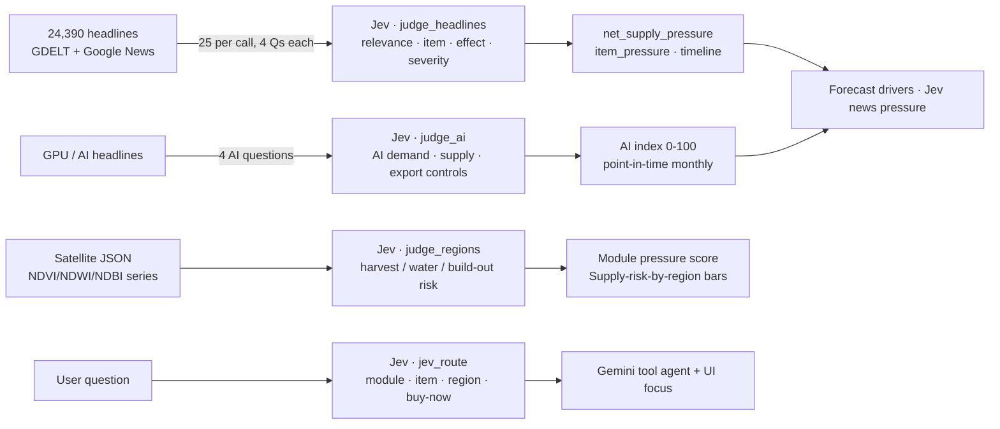

# Jev: typed, calibrated judgments at scale

[← back to README](../README.md) · [Modal](MODAL.md) · [Gemini](GEMINI.md) · [Architecture](ARCHITECTURE.md)

> **In one sentence:** Jev (TypeSafe's System One model, called as `jev-latest`, which was Jev 1.13 during the hackathon) reads text and JSON and gives our code typed answers with calibrated probabilities. We used it to turn 24,390 news headlines and 20 satellite time series into **142,016 numeric judgments** for about $0.70.

## Why Jev

Orbit has to answer lots of small common-sense questions, many times over:

- Is this headline about olive-oil supply at all?
- Which product does it affect?
- Does it push London prices up or down, and how much?
- Does this reservoir's water history look like a drought?

A chat LLM would return prose that we would have to parse, with no reliable probabilities and at a much higher cost per question. Jev returns **types**:

| Jev type | What comes back | How Orbit uses it |
|---|---|---|
| `Noul` | A probability that a statement is true (0..1) | `relevant_p`: is the headline about supply, costs or prices of our items? `buy_now`: is the user asking whether to buy now? |
| `Choice` | The chosen label, a probability per label, and `confidence` | Which item a headline affects; which module, item or region an Ask Orbit question is about |
| `Score` | An ordinal level (0..n-1), a probability per level, and `confidence` | Supply effect on 5 levels (strongly down … strongly up), severity (minor / notable / major), region risk (low … severe), AI demand / supply / export controls |

Because we get **probability distributions**, not just labels, we can do maths with them. For example, the net news pressure of a module is a relevance-weighted mean of expected price effects, and the module pressure score mixes Jev's region-risk distributions with forecast probabilities.

## Scale (from `data/built/signals/_stats.json`)

| What | Number |
|---|---|
| Headlines judged | **24,390** (16,737 in the base run, plus 7,653 AI-era GPU headlines) |
| Typed judgments | **142,016** (141,996 on headlines, 20 on satellite regions) |
| Judgments per headline | 4 standard (+4 AI-era for GPU headlines) |
| Questions per `system_one` call | 100 (25 headlines × 4 questions) |
| Calls in the base run | 673, in 1,413 s, on up to 56 Modal containers |
| Input tokens | 5.96 M (base) + 7.61 M (AI layer) + 0.04 M (regions) |
| Output tokens | 1.47 M (base) + 1.34 M (AI layer) |
| Estimated cost | **$0.31** for the base run by the code's own estimate (`jev_cost_usd_est`: all tokens at $0.042 per M). About **$0.69** across all runs with the same formula. |
| Live "Scan now" | 800 judgments in 45.8 s; peak **480 judgments/s** (`/api/scan/last`) |
| Ask Orbit | 4 judgments per question, under a 6 s timeout |

Per module (`data/built/signals/*.json`):

| Module | Headlines | Judgments | Judged relevant (p ≥ 0.5) | Net supply pressure (−1..1) | Regions judged |
|---|---|---|---|---|---|
| Groceries | 3,752 | 15,008 | 2,779 | +0.230 | 5 |
| Latte | 2,182 | 8,728 | 1,272 | +0.220 | 3 |
| Beer & Wine | 3,320 | 13,280 | 2,070 | +0.158 | 4 |
| GPU & Gadgets | 11,109 | 88,872 | 4,692 | +0.305 | 8 |
| Rent | 4,027 | 16,108 | 2,051 | +0.053 | – |

> These numbers are regenerated by `modal run modal_app/signals.py::main` / `::ai` / `::regions`.

## Four ways we use Jev



### 1. Headlines → 4 typed questions each (`modal_app/signals.py`)

One `system_one` call carries 25 headlines as state and 100 questions. Questions point at the state with backtick paths, for example `` `headlines.h7` ``:

```python
def _questions(i, items, rent):
    h = f"`headlines.h{i}`"
    return {
        f"rel{i}":  Noul(instructions=f"Headline {h} reports on supply, production, harvest, costs, demand or "
                                      f"prices relevant to these consumer items: `items`."),
        f"item{i}": Choice(instructions=f"Which consumer item's price is most affected by the news in headline {h}?",
                           criteria=crit),                       # {"chocolate": "Chocolate bar (100g)", …, "none": …}
        f"eff{i}":  Score(instructions=f"What does headline {h} imply for future consumer prices of the affected item?",
                          criteria=effect),                      # 5 levels: strong down … strong up
        f"sev{i}":  Score(instructions=f"How significant is the event in headline {h} for consumer prices?",
                          criteria=["Minor: …", "Notable: …", "Major: large shock to global supply or prices"]),
    }

@app.function(image=image, secrets=secrets, timeout=300, max_containers=20,
              retries=modal.Retries(max_retries=2, initial_delay=2.0))
def judge_headlines(batch: list[dict], module_id: str) -> dict:
    state = {"items": ", ".join(it["name"] for it in items),
             "headlines": {f"h{i}": h["title"] for i, h in enumerate(batch)}}
    qs = {}
    for i in range(len(batch)):
        qs.update(_questions(i, items, module_id == "rent"))
    with TypeSafeClient(retry=RetryPolicy(max_retries=4)) as c:
        r = c.system_one(state, qs)
    ...
    "price_pressure": round((float(eff.score) - 2) / 2, 3),        # -1..1, + = prices up
    "confidence": round(min(float(eff.confidence), float(sev.confidence), float(it.confidence)), 3)
```

The batches run through `judge_headlines.starmap(...)` on up to 20 Modal containers at once, well under Jev's limit of 1,200 requests per minute. The module aggregates are then computed like this:

- **`net_supply_pressure`** = Σ relevant_p × price_pressure / Σ relevant_p
- **`item_pressure`**: the mean pressure of relevant headlines per item
- **`timeline`**: monthly pressure and volume, for the charts

### 2. AI-era GPU index (`build_ai`, `judge_ai`)

For GPU & Gadgets, 14 targeted queries ("HBM shortage", "TSMC CoWoS capacity", "AI chip export controls", …) × 16 quarterly windows add 7,653 headlines. Jev scores each headline on **AI compute demand**, **GPU/memory supply constraint** and **export-control tightening** (5 levels each, mapped to −1..1). These are grouped by headline month into a point-in-time index:

`index = 50 + 50 × (0.55·demand + 0.35·supply + 0.10·export)`

Currently `ai_index.now.index` is **65.4**, with demand +0.36 and supply constraint +0.30. The index feeds the GPU and laptop "AI-era drivers" (see [MODEL.md](MODEL.md)).

### 3. Jev judges satellite statistics (`judge_regions`)

Jev reads JSON only, so we hand it numbers from orbit rather than pictures. For each of the 20 regions, it gets the anomaly block and the last 48 clear months (cloud ≤ 40%) and answers one `Score`. The question depends on the region type: harvest risk (crop), water-shortage risk for chip fabs (reservoir), build-out intensity (AI data centre / fab), or supply disruption (port / science park).

```json
{"region_id": "minas_coffee", "harvest_risk": {"label": "low", "probs": {"low": 0.89, "medium": 0.07, "high": 0.04, "severe": 0.0}}, "confidence": 0.85}
{"region_id": "stargate_abilene", "harvest_risk": {"label": "severe", "probs": {"low": 0.04, "medium": 0.08, "high": 0.32, "severe": 0.56}}, "confidence": 0.4}
```

The expected risk (0 / 0.5 / 1 weights over the label distribution) is 35% of each module's pressure score (`backend/data.py::_sat_component`). It also drives the "Supply risk by region" bars on the GPU page.

### 4. Routing every Ask Orbit question (`backend/agent.py`)

```python
qs = {
    "module":  Choice(instructions="Which Orbit price module is the user's question `question` about?", criteria=mod_criteria),
    "item":    Choice(instructions="Which consumer product is the user's question `question` about?", criteria=item_criteria),
    "region":  Choice(instructions="Which satellite-monitored producing region does the user's question `question` refer to?", criteria=region_criteria),
    "buy_now": Noul(instructions="The question `question` asks whether to buy now or wait (a timing decision about a purchase)."),
}
async with AsyncTypeSafeClient() as ts:
    r = await asyncio.wait_for(ts.system_one(state={"question": question}, questions=qs, model="jev-latest"), 6)
```

**Confidence gating.** Jev's route is passed to Gemini as a *hint* with its confidence, for example `module=latte (0.97)`. The UI jumps to a module, item or region only if Jev's confidence is **≥ 0.5** (or if Gemini actually called a tool for it). The UI shows the route and its confidence ("Jev routes the question"), so the audience sees a calibrated number, not a black box.

## What would be impossible or expensive without Jev

- **Cost.** 142k judgments with 100 questions per call came to 1.4k calls and under a dollar. Doing the same with a general LLM, prompting and parsing free text per headline, would cost far more and be much slower.
- **Calibration.** We use Jev's probabilities as numbers: weighted sums, distributions and the 0.5 gate. With a general LLM we would have to invent them or calibrate them after the fact.
- **Typed output.** `Noul` / `Choice` / `Score` come back as typed fields (`.noul`, `.choice`, `.score`, `.probabilities`, `.confidence`). There are no regex parsers and no JSON repair, so a pipeline of 1,400 calls finishes without format failures.
- **Speed on stage.** Routing a question takes one short call with 4 questions, and the live scan reaches hundreds of judgments per second.

## Honest limits

- Jev scores for historical headlines were produced *now*, by a model trained after those dates. So a little hindsight may leak into backtests that use the Jev AI index. The eval notes this (see [MODEL.md](MODEL.md#6-leakage-audit)).
- The Jev news-pressure term in the live forecast is **not backtested**, because headline history covers only about 2 years. Its effect is capped: share × 40% × 0.6 × pressure.
- The headline set is capped at 400 rows per module in `data/built/signals/*.json`. The full judged sets are kept in `/data/cache/signals/` on the Volume.
