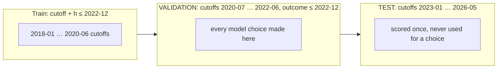

# Forecasting methodology

[← back to README](../README.md) · [Architecture](ARCHITECTURE.md) · [Jev](JEV.md) · [Modal](MODAL.md)

> **Summary for non-experts:** Commodity prices are close to a coin flip. The honest benchmark is "the price stays the same". We tested every method **as if it were the past**: at every month since 2018, it only saw the data available that month. We picked the final model using 2020–2022 only, and then scored it once on 2023–2026 data it had never seen. On that unseen period, Orbit v2 calls the direction of the 6-month move right **64% of the time**, catches **71% of big (>15%) price rises**, and has errors **2.6% smaller than "no change"**. That last margin is small, and we say so.

> The numbers on this page come from `data/built/eval/summary.json` and `data/built/eval/leaderboard.json`, generated 2026-09-19. They are rebuilt by `modal run modal_app/evaluate.py` and `python scripts/build_zoo.py`, and a model v3 is in progress, so re-read the files if they differ.

## 1. What we forecast

| Item | Driver series (what the model forecasts) | Source | Commodity share of retail price |
|---|---|---|---|
| Chocolate bar (100 g) | Cocoa `PCOCOUSDM` | FRED / IMF | 0.35 |
| Olive oil (1 L) | Olive oil `POLVOILUSDM` | FRED / IMF | 0.70 |
| Orange juice (1 L) | Orange `PORANGUSDM` | FRED / IMF | 0.45 |
| Loaf of bread | Wheat `PWHEAMTUSDM` | FRED / IMF | 0.20 |
| Latte (London café) | Coffee arabica `PCOFFOTMUSDM` | FRED / IMF | 0.12 |
| Pint of lager | Barley `PBARLUSDM` | FRED / IMF | 0.08 |
| High-end GPU | UK street-price index, x080-class card | **Curated** from 21 public anchor points | 1.0 |
| Laptop | US CPI computers & peripherals `CUSR0000SEEE01` | FRED / BLS | 0.85 |
| Bottle of wine | – | **Synthetic** (not evaluated) | 0.25 |
| 1-bed rent, London | – | **Synthetic** + Sentinel-2 built-up change (not evaluated) | 1.0 |

We forecast the driver series. It becomes a London retail price by simple pass-through: `retail_future = retail_now × (1 + share × driver_change)`. The live forecast then adds two terms that are **not backtested**: 3% UK CPI on the non-commodity share, and a small Jev news-pressure term.

## 2. Point-in-time backtesting



- **Rolling origin.** For each item and each monthly cutoff from 2018-01 to 2026-05, the series is **truncated at the cutoff** and the model forecasts 3, 6 and 12 months ahead. Nothing after the cutoff is passed in. The GPU series is evaluated only at anchor months (7 test cutoffs), so its context never depends on a later anchor.
- **TimesFM runs.** 1,436 point-in-time runs on **10 NVIDIA L4 GPUs on Modal**, with 2 context lengths (the full series and the last 96 months). Every horizon is scored, which gives 8,256 scored forecasts across methods, horizons and items.
- **Splits**, the same for every model:
  - *train*: cutoff + h ≤ 2022-12;
  - **VALIDATION**: cutoffs 2020-07..2022-06 with outcome ≤ 2022-12. All model selection happens here;
  - **TEST**: cutoffs ≥ 2023-01. Reported once.
- **Walk-forward refits.** Learned members (ridge, logistic, LightGBM) are refit at every cutoff, using only rows whose outcome month is ≤ that cutoff.
- **Every feature is point-in-time.** Satellite anomalies, weather z-scores, FX, momentum and volatility all stop at the cutoff. Published-with-lag series (freight PPI, ONI) are shifted by their release lag.

### Metrics

| Metric | Meaning |
|---|---|
| MAPE | Mean absolute % error of the p50 |
| **Skill** | `1 − MAE / MAE_naive`. Above 0 means better than "no change". |
| Direction accuracy | Share of forecasts whose sign matches the actual move (moves under 1% are ignored) |
| 80% band coverage | Share of outcomes inside p10–p90 (the target is 0.80) |
| Brier P(up) / P(>15%) | Calibration of the probabilities (lower is better) |
| Big-rise recall | Share of actual >15% 6-month rises that were flagged |

## 3. The model zoo

| Member | Idea | File |
|---|---|---|
| `naive` | Price stays the same (the benchmark) | `build_eval.py` |
| `drift` | 24-month log trend continues | `build_eval.py` |
| `climatology` | Historical base rates for probabilities | `build_zoo.py` |
| `timesfm` | **Google TimesFM 3.0**, zero-shot, 9 quantiles | `evaluate.py` |
| `orbit_v1` | TimesFM band re-centred by a small overlay (damping, trend blend, satellite tilt, momentum, cap) tuned on train | `build_eval.py` |
| `ets`, `arima`, `theta` | Nixtla statsforecast AutoETS / AutoARIMA / AutoTheta on log prices, 100 Modal CPU containers | `zoo_stats.py` |
| `stat_combo` | M4-style combination of the above (+ TimesFM): inverse-MAE weights from *past* errors only, damped | `zoo_stats.py` |
| `quant_tsmom` | Ridge on vol-scaled momentum (1/3/6/12 m), MA crossover, breakouts, drawdown, 5-year z-score, vol regime, satellite stress. Panel = 8 items + ~30 IMF commodity series | `zoo_quant.py` |
| `bigmove_clf` | Logistic / shallow LightGBM for P(up) and P(rise > 15%), Platt-scaled | `zoo_quant.py` |
| `exog_ridge` | Ridge with item fixed effects on **ERA5 weather** (precip / temperature z, heat days) per crop region, **Sentinel-2** NDVI / NDWI z-scores, GBP/USD, Brent, EU gas | `zoo_exog.py` |
| `learner` | **LightGBM stacked on TimesFM**, trained on 81 series (71 World Bank Pink Sheet), 5,534 train rows | `train.py` |

## 4. Orbit v2: the stack

Built by [`scripts/build_zoo.py`](../scripts/build_zoo.py), separately for each horizon h:

1. **Members.** Only methods whose VALIDATION skill vs naive is above 0 are eligible. `learner` and `bigmove_clf` are excluded (see the audit below).
2. **Point forecast.** `p50 = base × exp(Σ w_m · ln(p50_m / base))` with `w ≥ 0`. Weights come from NNLS or from equal weights × shrink. The choice is made by **leave-one-item-out cross-validation on VALIDATION**, and `Σw ≤ 1` shrinks toward no-change.
3. **Bands: split-conformal prediction.** Normalised residual `e = ln(actual / p50) / w_row`, where `w_row` is the members' mean half log-band. The 10% / 90% quantiles of `e` are taken over past rows whose outcome month is ≤ the forecast's cutoff (an expanding or 36-month window, picked on VALIDATION). The bands are therefore calibrated only from errors that were already observable.
4. **Probabilities.** P(up) and P(>15%) mix the conformal distribution with the members' classifier probabilities. The mix weight and a logit temperature are picked on the VALIDATION Brier score. The big-rise alert threshold (**0.22**) is picked on VALIDATION F1.

Final weights (from `leaderboard.json → final`):

| Horizon | Kind | Weights |
|---|---|---|
| 3 months | NNLS | `exog_ridge` 1.0 |
| **6 months** | equal-weight | `orbit_v1` 0.25 · `stat_combo` 0.25 · `quant_tsmom` 0.25 · `exog_ridge` 0.25 |
| 12 months | NNLS | `orbit_v1` 1.0 |

The live forecast shown in the app applies these weights at the latest month (`build_zoo.py → live`, then `build_orbit_signal.py`). It also writes a per-item `drivers` breakdown (trend, TimesFM, stats, quant, FX, oil, gas, satellite, Jev news, CPI) whose contributions add up to the 6-month change.

## 5. Leaderboard: TEST, 6 months ahead

Cutoffs 2023-01 → 2026-05, 8 items, **n = 266** forecasts, 65 actual big rises. Taken from [`data/built/eval/leaderboard.json`](../data/built/eval/leaderboard.json).

| Method | MAPE % | Skill vs naive | Direction | 80% coverage | Band width % | Brier P(up) | Big-rise F1 |
|---|---|---|---|---|---|---|---|
| naive (no change) | 19.2 | 0.000 | – | – | – | – | – |
| drift (24 m trend) | 24.3 | −0.164 | 52.2% | – | – | – | – |
| climatology | 19.2 | 0.000 | – | – | – | 0.253 | 0.393 |
| TimesFM 3.0 | 19.1 | −0.017 | 50.2% | 75.6% | 51.8 | 0.264 | 0.395 |
| Orbit v1 (tuned overlay) | 19.7 | −0.002 | 49.4% | 79.3% | 54.2 | 0.249 | 0.370 |
| stat_combo | 19.4 | +0.007 | 56.5% | 77.4% | 68.2 | 0.254 | 0.423 |
| ets | 19.5 | 0.000 | 57.4% | 76.3% | 69.1 | 0.248 | 0.438 |
| arima | 19.3 | −0.001 | 51.4% | 77.8% | 70.7 | 0.255 | 0.418 |
| theta | 19.5 | −0.003 | 50.6% | 79.3% | 67.3 | 0.255 | 0.400 |
| quant_tsmom | 18.9 | +0.023 | 58.0% | 83.5% | 62.6 | 0.241 | 0.442 |
| bigmove_clf *(not in stack)* | 19.2 | 0.000 | 57.1% | 83.1% | 65.5 | 0.248 | 0.441 |
| exog_ridge | **18.7** | +0.011 | 58.8% | 83.8% | 75.7 | 0.245 | 0.442 |
| learner *(not in stack)* | 20.5 | −0.077 | 51.0% | 68.4% | 52.8 | 0.283 | 0.397 |
| **Orbit v2 (stack)** | 18.9 | **+0.026** | **63.9%** | 77.4% | 59.3 | 0.245 | 0.400 |

Orbit v2 on TEST at other horizons: **3 months**: skill +0.017, direction 59.6%, coverage 77.5%. **12 months**: skill −0.030, direction 48.2%, coverage 77.9%. So v2 does *not* help at 12 months.

**v2 vs v1 on TEST at 6 months** (`improvement_vs_v1`):

| | v1 | v2 |
|---|---|---|
| Skill | −0.002 | +0.026 |
| Direction | 49.4% | 63.9% |
| Big-rise recall (harness) | 66.2% | 70.8% |
| Big-rise alert recall / precision (P(>15%) ≥ 0.22) | 60.0% / 26.7% | 81.5% / 26.5% |
| 80% coverage | 79.3% | 77.4% (slightly worse) |
| Band width | 54.2% | 59.3% (wider) |

**Calibration** (TEST, 6 months, P(up) bins):

| Bin | n | Predicted | Observed |
|---|---|---|---|
| 0.30–0.45 | 53 | 0.43 | 0.43 |
| 0.45–0.55 | 104 | 0.50 | 0.40 |
| 0.55–0.70 | 107 | 0.59 | 0.56 |
| 0.70–1.00 | 2 | 0.71 | 1.00 |

**Out-of-sample stories** (TEST period, from `summary.json → highlights`):

- Chocolate, 2023-11: v2 gave a **30%** chance of a >15% rise (p50 +5%). It rose **+90%**.
- Latte, 2024-08: 31% chance (p50 +4%). It rose +57%.
- Orange juice, 2023-05: 32% chance (p50 +0%). It rose +49%.
- Olive oil, 2023-04: 26% chance (p50 +1%). It rose +46%.
- **Honest miss:** chocolate from 2023-10. v2 said +3% (P(>15%) 22%). It went **+167%**.

The pattern: v2 raises the *alarm probability* above the 0.22 threshold ahead of most big rises, but its p50 badly underestimates their size.

### The LightGBM learner on a wider universe

`modal run modal_app/train.py` (`data/built/model/summary.json`) trains on 81 series. On its own TEST set (973 rows, 2023-01..2026-01 cutoffs) its MAE is 13.98% vs 14.00% for naive and 13.77% for TimesFM. Direction is 56.4% and big-move recall 27.5%. Its most important features are distance to the 5-year mean (26%), 12-month momentum (15%) and 12-month volatility (13%). **The satellite anomaly feature gets 1.0% of the gain.** On our 8 items it performs worse on TEST (skill −0.077), and it is excluded from the stack.

## 6. Leakage audit

We wrote these down in `leaderboard.json → notes` and `summary.json`:

1. **TEST was seen once before three design changes.** After a first full run, we made three changes that were motivated a priori: the learner was excluded (its hyperparameters were picked on 2019–2022, which overlaps VALIDATION), stack weights were capped at Σw ≤ 1, and drift was removed as a member. So v2 TEST numbers are **not fully untouched**. The pre-registered design (no cap, drift and learner allowed) scores TEST h6 skill **+0.018**, direction 60.4%, h12 skill −0.19.
2. **Bootstrap uncertainty.** A block bootstrap over 6-month cutoff blocks gives a 90% CI of **0.005 … 0.040** for v2's TEST 6-month skill, and **54% … 73%** for direction.
3. `bigmove_clf`: its probability recalibration grid was narrowed after its builder saw TEST once, so it is removed from v2's probability members.
4. `orbit_v1` parameters were tuned on cutoff + h ≤ 2022-12, which overlaps VALIDATION, so its VALIDATION numbers are in-sample.
5. **Pre-training leakage we cannot control.** TimesFM's pre-training corpus and Jev's / LLM news scores (used for the GPU and laptop AI drivers) may contain knowledge from after a cutoff.
6. The extra FRED panel series are today's vintage. These series are rarely revised.
7. **Data fix.** The FRED olive-oil series has a Nov–Dec 2020 glitch. Two points are replaced by the median of their neighbours. This is the only use of data from after a cutoff.

## 7. Orbit v1 (kept for comparison)

`scripts/build_eval.py` tunes six parameters on a small grid (552 combinations) over *train* rows:

`f(h) = (damp−1)·ln(q50/base) + blend·slope24·h + tilt·min(h,6)/6 + ai·drift12_ai·h/12`

The objective was error vs naive, averaged over 3 / 6 / 12 months, minus 0.05 × big-rise recall. On error alone, the fit picks "never move", which is useless for a warning system.

The fit chose `damp = 0`, `blend = 0.25` and **`sat = 0`**: the Sentinel-2 NDVI tilt did **not** improve out-of-sample error, so it gets weight 0. Satellite data still drives module pressure scores, the Jev region judgments, the GPU build-out driver and the `exog_ridge` member, but it has no validated standalone forecast skill yet. The UI says this too ("tracked, but no validated forecast skill yet → weight 0").

**AI-era drivers (GPU, laptop).** These use the Jev AI index and Sentinel-2 build-out / reservoir signals. Their coefficients are **priors, not fitted**, because the Jev index starts in 2022-09. On TEST (44 forecasts), they raise 6-month skill from +0.007 to +0.065 but lower direction accuracy from 63% to 45%.

## 8. Limitations

- We do **not** reliably beat "no change" at 12 months, and the 6-month edge (+0.026 skill) is small, with a CI that only just excludes 0.
- Big-rise alerts come with low precision (about 27%): about three false alarms per real spike.
- The p50 underestimates the size of shocks (chocolate 2023–24).
- The GPU series is curated and small (7 test cutoffs). Wine and rent are synthetic and are not evaluated.
- Jev news pressure and CPI in the live forecast are **not** backtested.
- Retail prices use a fixed pass-through share per item, not a fitted model.

## 9. What's next: v3 (in progress)

New candidates are being built and are **not yet in the leaderboard above**:

- `zoo_dir.py`: a calibrated direction classifier over the World Bank panel, with CFTC positioning features, walk-forward isotonic calibration and a VALIDATION-picked **confidence gate**;
- `zoo_xasset.py`: a cross-asset ridge (USD index, BRL, EUR/XOF peg, urea, DAP, freight PPI, ENSO ONI);
- `scripts/zoo_meta.py`: a meta-vote over members.

They follow the same VALIDATION-only selection rules. When they land, `leaderboard.json` is regenerated.

## Reproduce

```powershell
.\.venv\Scripts\modal run modal_app/evaluate.py          # TimesFM point-in-time runs on 10 × L4, then scripts/build_eval.py
.\.venv\Scripts\modal run modal_app/train.py             # LightGBM learner (needs Pink Sheet; GPU for TimesFM features)
.\.venv\Scripts\modal run modal_app/zoo_stats.py         # ETS / ARIMA / Theta on up to 100 CPU containers
.\.venv\Scripts\modal run modal_app/zoo_live.py          # latest-month stat fits for the live stack
.\.venv\Scripts\modal run modal_app/zoo_quant.py
.\.venv\Scripts\modal run modal_app/zoo_exog.py
.\.venv\Scripts\python scripts/build_zoo.py              # leaderboard.json + Orbit v2 + live v2
.\.venv\Scripts\python scripts/build_orbit_signal.py     # write live forecasts + drivers
```
