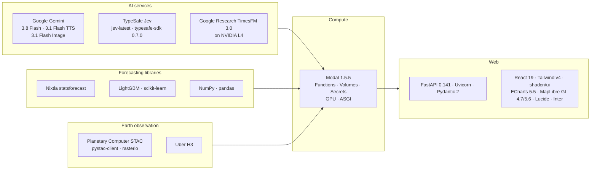

# Tech stack, APIs and data sources

[← back to README](../README.md) · [Architecture](ARCHITECTURE.md) · [Jev](JEV.md) · [Modal](MODAL.md) · [Gemini](GEMINI.md)

The versions below are taken from [`requirements.txt`](../requirements.txt), from the `pip_install` / `uv_pip_install` calls of the Modal images and from [`web/package.json`](../web/package.json).

## At a glance

## AI and model providers

| Tool | Version / model id | What it does for Orbit | Where in code |
|---|---|---|---|
| **Google Gemini** via `google-genai` | SDK `2.24.0`; model `gemini-3.8-flash` | Ask Orbit agent with function calling (Interactions API); multimodal vision on then-vs-now Sentinel-2 tiles; module headline and 3 insight cards as JSON-schema structured output; the briefing script | [`backend/agent.py`](../backend/agent.py), [`scripts/build_insights.py`](../scripts/build_insights.py), [`backend/briefing.py`](../backend/briefing.py) |
| Gemini TTS | `gemini-3.1-flash-tts-preview`, voice "Charon" | ~30-second spoken "Tomorrow's Prices" briefing (WAV) | [`backend/briefing.py`](../backend/briefing.py) |
| Gemini image generation | `gemini-3.1-flash-image` | Product photos for all 10 items (`web/public/products/*.jpg`) and early UI mock-ups (`design/images/`) | assets; spec in [`design/MODULES.md`](../design/MODULES.md) |
| **TypeSafe Jev** via `typesafe-sdk` | SDK `0.7.0`; model `jev-latest` | Typed, calibrated judgments (`Noul`, `Choice`, `Score`) on 24,390 headlines, 20 satellite regions and every Ask Orbit question. 142,016 judgments in total. | [`modal_app/signals.py`](../modal_app/signals.py), [`backend/agent.py`](../backend/agent.py). See [JEV.md](JEV.md). |
| **Google Research TimesFM 3.0** | `timesfm[torch]==3.0.2`, weights `google/timesfm-3.0-pytorch` (falls back to TimesFM 2.5 200M) | Zero-shot probabilistic time-series forecasts (9 quantiles, 12 months) on NVIDIA L4 | [`modal_app/forecast.py`](../modal_app/forecast.py), [`evaluate.py`](../modal_app/evaluate.py), [`train.py`](../modal_app/train.py) |

Our Google AI Studio key was also verified with `gemini-3.1-pro-preview` and `gemini-3.5-flash-lite`. Neither is on the runtime path today: Flash was fast enough and good enough for every step.

## Compute and infrastructure

| Tool | Version | Use | Where |
|---|---|---|---|
| **Modal** | `modal==1.5.5` | All heavy compute: CPU fan-out up to 100 containers, NVIDIA L4 GPUs, Volumes `orbit-data` and `orbit-models`, Secret `orbit-secrets`, the public ASGI web app, and live `Function.from_name` calls from the backend | `modal_app/*.py`, [`backend/scan.py`](../backend/scan.py). See [MODAL.md](MODAL.md). |
| NVIDIA L4 | – | TimesFM inference: live forecasts, 1,436 point-in-time backtests, 6,695 training contexts | `gpu="L4"` |
| Python | 3.12 | Everywhere (local `.venv` and `debian_slim(python_version="3.12")` images) | – |

## Backend

| Library | Version | Use |
|---|---|---|
| FastAPI | 0.141.1 | HTTP API, SSE `StreamingResponse`, static files, routers |
| Uvicorn | 0.53.0 | Local ASGI server |
| Pydantic | 2.13.5 | Request models (`AskIn`) and FastAPI validation |
| httpx | 0.28.1 | GDELT / RSS / FRED fetches |
| feedparser | 6.0.14 | Google News RSS parsing |
| python-dotenv | 1.2.3 | Loads `.env` (`GEMINI_API_KEY`, `TYPESAFE_API_KEY`) |
| numpy / pandas / pyarrow | 2.5.3 / 3.0.6 / 25.0.1 | Local build scripts (stacking, conformal, features parquet) |

## Modal container images (installed inside Modal)

| Image | Packages | Apps |
|---|---|---|
| Satellite | `pystac-client`, `planetary-computer`, `rasterio`, `numpy`, `pillow`, `shapely` (+ GDAL HTTP retry env) | `orbit-satellite`, `orbit-rent`, `orbit-rent-detail` (+ `h3>=4`, `httpx`) |
| Signals | `typesafe-sdk`, `httpx`, `feedparser` | `orbit-signals` |
| GPU | `timesfm[torch]==3.0.2`, `numpy`; `HF_HOME=/models/hf` | `orbit-forecast`, `orbit-eval`, `orbit-train` |
| Classical stats | `statsforecast>=2.0`, `numpy`, `pandas` | `orbit-zoo-stats` |
| Learners | `lightgbm`, `scikit-learn`, `numpy`, `pandas`, `openpyxl` | `orbit-train`, `orbit-zoo-quant`, `orbit-zoo-dir` |
| Web | `fastapi==0.141.1`, `uvicorn==0.53.0`, `google-genai==2.24.0`, `typesafe-sdk==0.7.0`, `python-dotenv`, `httpx`, `modal==1.5.5` | `orbit-web` |

## Forecasting methods

| Method | Library | Role | File |
|---|---|---|---|
| TimesFM 3.0 | `timesfm` | Foundation-model quantiles | `forecast.py`, `evaluate.py` |
| AutoETS, AutoARIMA, AutoTheta | Nixtla `statsforecast` | M4-style inverse-error combination | `zoo_stats.py` |
| Ridge time-series momentum | NumPy | Vol-scaled momentum and mean reversion over ~40 commodity series | `zoo_quant.py` |
| Big-move classifier | L2 logistic / LightGBM + Platt scaling | P(rise > 15%) | `zoo_quant.py` |
| Exogenous ridge | NumPy | Weather (ERA5), Sentinel-2, GBP/USD, Brent, EU gas | `zoo_exog.py` |
| LightGBM learner | `lightgbm` | Stacked on TimesFM, trained on 81 series (71 World Bank) | `train.py` |
| Orbit v2 stack | NumPy (NNLS, split-conformal) | Final forecast | `scripts/build_zoo.py` |
| In progress (v3 candidates) | LightGBM / logistic + isotonic; ridge; meta-logistic | Direction classifier with CFTC positioning; cross-asset ridge; meta-vote | `zoo_dir.py`, `zoo_xasset.py`, `scripts/zoo_meta.py` |

Details in [MODEL.md](MODEL.md).

## Frontend

The dashboard (`/`) and the landing page (`/landing`) are one React app in [`web/`](../web), built to
`frontend_react/`. Versions come from [`web/package.json`](../web/package.json).

| Library | Version (npm) | Use |
|---|---|---|
| React + React DOM | 19.2 | The whole UI: 11 routed screens, each lazily imported as its own chunk |
| Vite | 8.3 | Dev server (proxies `/api`, `/tiles`, `/static` to the backend) and production build |
| Tailwind CSS | 4.3 | Utilities + theme only — **preflight is off**, so the hand-written Orbit CSS (`web/src/styles/`) is untouched |
| shadcn/ui (Radix) | new-york, JSX | Button, Badge, Card, Tabs, ToggleGroup, Dialog, Separator, Skeleton, Progress, Sonner — restyled with Orbit variants (`variant="orbitPrimary"` → `.btn.primary`) |
| react-router-dom | 7 | `BrowserRouter`: clean URLs (`/earth`, `/mission/scan`); the backend serves the app for them, and old `/#/route` links redirect |
| sonner | 2.0 | Toasts (unstyled, wearing the Orbit `.toast` class) |
| Apache ECharts | 5.5.1 | Fan charts with p10–p90 bands, driver waterfalls, waffles, leaderboard, reliability diagram |
| MapLibre GL JS | 4.7.1 | Earth view on EOX Sentinel-2 cloudless; Overview map; Rent Radar 2D/3D `fill-extrusion` boroughs and H3 hexes |
| WebGL2 (no library) | browser | The landing globe: one fragment shader on a baked Sentinel-2 cloudless texture (`web/src/landing/globe-gl.js`, texture from `scripts/build_globe_texture.py`) |
| lucide-react | 0.460.0 | UI icons, through an explicit registry (`web/src/lib/lucide-icons.js`) so only the ~100 icons in use are bundled |
| Inter (Google Fonts) | – | Typeface |
| Web Speech API | browser | Voice input in Ask Orbit (`SpeechRecognition`) |

deck.gl is gone: it was loaded by the old `index.html` but no view ever used it — the 3D Rent Radar is
MapLibre `fill-extrusion`.

**Where the imperative code lives.** React owns markup, state and composition; ECharts, MapLibre and the
drag-compare sliders run in `useEffect` with refs (`web/src/lib/forecastChart.js`, `signalCards.js`,
`echarts.js`, `motion.js`, `lightbox.js`), which is the same code as the vanilla build. The News hub keeps
its 60 fps counter lerp and feed slide-in on refs so a live firehose never re-renders the tree.

## Design tooling

| Tool | Use |
|---|---|
| Design spec | The screens were designed at 1440×900, then implemented. The spec is in [`design/DESIGN.md`](../design/DESIGN.md), [`design/MODULES.md`](../design/MODULES.md) and [`design/NEWS_HUB.md`](../design/NEWS_HUB.md). Mock-ups: `design/0*.png`, `design/modules/*.png`. |
| Playwright (optional) | Headless screenshots for visual QA (`design/shots/*.png`) |

## External data sources

| Source | What we take | Access | Licence / terms |
|---|---|---|---|
| **Copernicus Sentinel-2 L2A** via **Microsoft Planetary Computer STAC** | Bands B02, B03, B04, B08, B11 + SCL cloud mask for 20 regions × 92 months, and London mosaics for 2019 and 2026 | `pystac-client` + `planetary_computer.sign_inplace`, windowed COG reads with `rasterio` | Copernicus Sentinel data, free and open ("Contains modified Copernicus Sentinel data 2019–2026"); Planetary Computer terms of use |
| **EOX Sentinel-2 cloudless 2020** | Background imagery on the Earth view and the landing globe (WMTS `s2cloudless-2020_3857`) | tiles.maps.eox.at | **CC BY-NC-SA 4.0**, "Sentinel-2 cloudless – https://s2maps.eu by EOX IT Services GmbH (Contains modified Copernicus Sentinel data 2020)". Non-commercial use only. |
| **FRED** (Federal Reserve Bank of St. Louis) | IMF primary commodity prices (`PCOCOUSDM`, `POLVOILUSDM`, `PORANGUSDM`, `PWHEAMTUSDM`, `PCOFFOTMUSDM`, `PBARLUSDM`, ~30 more for the quant panel); BLS CPI `CUSR0000SEEE01`; `DEXUSUK`, `DEXBZUS`, `DTWEXBGS`, `PCU483111483111` | CSV download (fetched locally, then uploaded to the Volume, because FRED blocks many cloud IPs) | FRED terms; the underlying IMF / BLS data is public |
| **World Bank Commodity Price Data ("Pink Sheet")** | ~70 monthly commodity series (training and direction panels; urea, DAP, Brent, EU gas) | `CMO-Historical-Data-Monthly.xlsx` | CC BY 4.0 |
| **GDELT DOC 2.0** | News article lists per module, 24 monthly windows | `api.gdeltproject.org/api/v2/doc/doc` (1 request / 5 s) | Free, attribution to the GDELT Project |
| **Google News RSS** | Headlines only (title, link, date, source) per module and quarter, plus the live "last 7 days" feed | `news.google.com/rss/search` | Headlines and links only; we store no article bodies |
| **Open-Meteo ERA5 archive** | Monthly precipitation, temperature and heat days per crop region since 1981 | `archive-api.open-meteo.com` | CC BY 4.0 (Open-Meteo); ERA5 by Copernicus Climate Change Service |
| **CFTC Commitments of Traders** | Non-commercial net positioning (legacy futures-only) | Yearly zip files | US government public data |
| **NOAA Oceanic Niño Index (ONI)** | ENSO state for tropical crops | NOAA CPC text file | US government public data |
| **London borough boundaries** | GeoJSON of 33 boroughs | `radoi90/housequest-data` on GitHub (see `orbit/config.py`) | Boundary data originally from UK open data (OGL); see the source repo |
| **CARTO basemaps** | Dark Matter raster and GL styles (Rent Radar) | basemaps.cartocdn.com | © CARTO, © OpenStreetMap contributors (ODbL) |
| **Esri World Light Gray Canvas** | Overview watch-list map background | server.arcgisonline.com | Esri basemap terms; attribution "Esri" |

### What is real and what is synthetic

| Data | Status |
|---|---|
| Sentinel-2 indices and every tile shown in the app | **Real** (1,840 tiles) |
| Headlines and Jev judgments | **Real** (24,390 headlines, 142,016 judgments) |
| Commodity price histories (cocoa, olive oil, orange juice, wheat, coffee, barley), laptop CPI | **Real** (FRED) |
| GPU street-price index | **Curated** from 21 public anchor points (launch prices, reported street prices, 2026 GDDR7-crunch reports), interpolated between anchors |
| Wine driver series, London 1-bed rents | **Synthetic but plausible** (`synthetic_driver` in `forecast.py`, `RENTS` in `rent.py`) |
| Rent Radar built-up change | **Real** Sentinel-2 NDBI change, summer 2019 vs the latest summer |
| Retail "today" prices | Hand-set London reference prices in `orbit/config.py` |
| Images in `design/images/` and product photos | AI-generated (Gemini). No generated image is presented as satellite data. |
